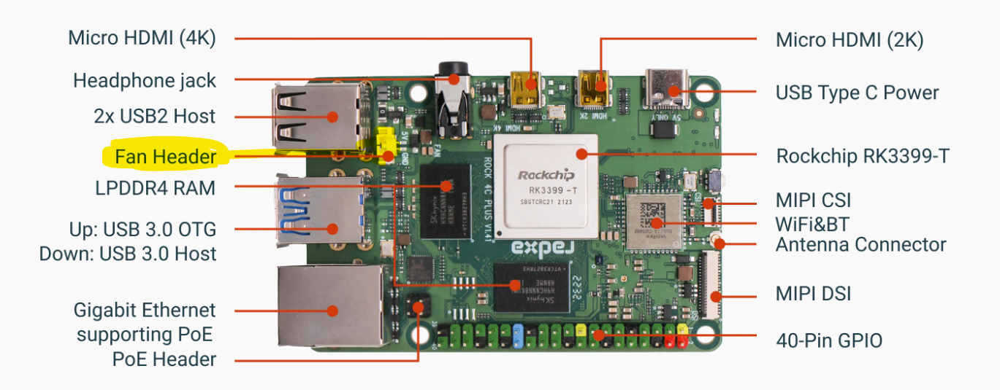

# Armbian on the Radxa Rock 4C+

## Overview

This repository provides setup scripts for the Radxa Rock 4C+ single-board computer
running Armbian. The scripts install and activate device tree overlays and configure
hardware peripherals.

## How it works

All installer scripts share a common library `rock4cp-common.sh` which is downloaded
automatically from this repository at runtime. There is no need to clone the repo — each
script is self-contained and can be piped directly from `curl`.

The following utility scripts are downloaded to `/tmp/` on demand:

| Script | Purpose |
|---|---|
| `rock4cp-common.sh` | Shared helper functions (download, dtc compile, overlay registration) |
| `armbian-activate-overlay` | Activates an existing overlay in `/boot/armbianEnv.txt`; based on `armbian-add-overlay` |

---

## Device Tree Overlay Scripts

### USB OTG — peripheral mode

Switches the upper USB 3.0 port from host mode (default) to peripheral (gadget/device)
mode so the Rock 4C+ can be connected to another computer as a USB device.

```shell
curl https://raw.githubusercontent.com/herrfrei/armbian-rpk4cp/main/rock4cp_usb_otg.sh | bash
```

To additionally lock the port to USB 3.0 SuperSpeed (5 Gbit/s):

```shell
curl https://raw.githubusercontent.com/herrfrei/armbian-rpk4cp/main/rock4cp_usb_otg.sh | bash -s -- --super-speed
```

|    Option     |                   Description                    |       Default        |
|---------------|--------------------------------------------------|----------------------|
| `--super-speed` | Add `maximum-speed = "super-speed"` to the overlay | Off (auto-negotiate) |

> **Note:** use `--super-speed` only when connecting to a USB 3.0 host port. For  
> USB 2.0 hosts omit the flag and let the controller negotiate speed automatically.

___

### DS3231 Real-Time Clock on I2C7

Registers a Maxim DS3231 RTC module at I2C address `0x68` on the I2C7 bus.  
Also disables the `fake-hwclock` service and installs a real `hwclock` systemd  
service that syncs the hardware clock on boot and shutdown.

```shell
curl https://raw.githubusercontent.com/herrfrei/armbian-rpk4cp/main/rock4cp_rtc_ds3231.sh | bash
```

This script:

1.  Activates the vendor `rk3399-i2c7` overlay (already on the system, no download)
2.  Compiles and installs the `rk3399-i2c7-ds3231` user overlay
3.  Stops and disables `fake-hwclock`
4.  Installs and enables a `hwclock.service` systemd unit

___

### PWM Fan Control

Installs smooth, continuous PWM fan control via the `fancontrol` daemon. Unlike the  
kernel thermal governor approach (which uses discrete temperature trip points), `fancontrol`  
linearly interpolates the fan speed between a configurable minimum and maximum temperature  
every 3 seconds.

```shell
curl https://raw.githubusercontent.com/herrfrei/armbian-rpk4cp/main/rock4cp_fancontrol.sh | bash
```

With custom temperature and PWM settings:

```shell
curl https://raw.githubusercontent.com/herrfrei/armbian-rpk4cp/main/rock4cp_fancontrol.sh | bash -s -- \
  --min-temp=55 --max-temp=80 --min-pwm=0 --max-pwm=255 --min-start=64 --min-stop=48
```

|    Option     |                         Description                         | Default |
|---------------|-------------------------------------------------------------|---------|
| `--min-temp=N`  |            Temperature (°C) at which fan starts             |   `60`    |
| `--max-temp=N`  |      Temperature (°C) at which fan reaches full speed       |   `85`    |
|  `--min-pwm=N`  | PWM value (0–255) at min-temp (0 = fan off below threshold) |    `0`    |
|  `--max-pwm=N`  |                PWM value (0–255) at max-temp                |   `255`   |
| `--min-start=N` |          Minimum PWM to spin the fan from stopped           |   `64`    |
| `--min-stop=N`  |  PWM below which a running fan stops (must be < min-start)  |   `48`    |

**Fan connector:** 2-pin 1.25 mm, 5 V — the small connector near the USB 2.0 ports.



**PWM curve** (default settings):

| CPU temperature |       PWM        |    Fan speed    |
|-----------------|------------------|-----------------|
|     < 60 °C     |        0         |       Off       |
|      60 °C      | 64 (start pulse) | Starts spinning |
|      65 °C      |       ~51        |      Slow       |
|      70 °C      |       ~102       |     Medium      |
|      75 °C      |       ~153       |      Fast       |
|      80 °C      |       ~204       |      High       |
|     ≥ 85 °C     |       255        |   Full speed    |

This script installs in two phases:

-   **Install time:** compiles the `rk3399-pwm-fan` overlay, installs `fancontrol` and  
    `lm-sensors`, and registers a one-shot `rock4cp-fancontrol-setup.service`.
-   **First boot:** the setup service detects the correct `hwmon` device numbers (which  
    can vary between kernel versions), writes `/etc/fancontrol` with the correct paths and  
    the settings chosen at install time, and starts the `fancontrol` service. The setup  
    service then disables itself and never runs again.

Check the setup log after first reboot:

```shell
journalctl -u rock4cp-fancontrol-setup
journalctl -u fancontrol
```

___

### Disable HDMI Output

Disables the HDMI video controller and HDMI audio device. Useful for headless servers  
to suppress display enumeration, reduce power draw, and remove the HDMI device from the  
ALSA sound card list so audio routing to other cards is unambiguous.

```shell
curl https://raw.githubusercontent.com/herrfrei/armbian-rpk4cp/main/rock4cp_disable_hdmi.sh | bash
```

To re-enable HDMI, remove `rk3399-hdmi-disable` from `user_overlays` in  
`/boot/armbianEnv.txt` and reboot.

___

### Disable GPU

Disables the Mali-T860MP4 GPU. Useful for headless servers that run no graphical  
workloads — prevents the `panfrost` driver from loading, removes the GPU from the  
DRM/KMS subsystem, and eliminates GPU idle power draw.

```shell
curl https://raw.githubusercontent.com/herrfrei/armbian-rpk4cp/main/rock4cp_disable_gpu.sh | bash
```

The overlay is kept generic (`compatible = "rockchip,rk3399"`) and compatible with other  
Rockchip RK3399 boards.

To re-enable the GPU, remove `rockchip-gpu-disable` from `user_overlays` in  
`/boot/armbianEnv.txt` and reboot.

___

### Combining overlays for a headless server

For a fully headless server install both disable scripts. The resulting  
`/boot/armbianEnv.txt` will contain:

```ini
user_overlays=rk3399-hdmi-disable rockchip-gpu-disable
```

|              Goal              |                Scripts to run                |
|--------------------------------|----------------------------------------------|
| Headless, keep GPU for compute |            `rock4cp_disable_hdmi.sh`             |
|     Fully headless, no GPU     | `rock4cp_disable_hdmi.sh` + `rock4cp_disable_gpu.sh` |
|        PWM fan control         |            `rock4cp_fancontrol.sh`             |
|     USB gadget / TeslaUSB      |               `rock4cp_usb_otg.sh`               |
|           DS3231 RTC           |             `rock4cp_rtc_ds3231.sh`              |

___

## Other Adjustments

### Bluetooth / Wi-Fi Firmware

Creates the missing firmware symlink required for Bluetooth on the Rock 4C+:

```shell
curl https://raw.githubusercontent.com/herrfrei/armbian-rpk4cp/main/rock4cp_wifi_bt_fw.sh | bash
```

___

## TeslaUSB Installation

1.  Install the USB OTG overlay:
    
    ```shell
    curl https://raw.githubusercontent.com/herrfrei/armbian-rpk4cp/main/rock4cp_usb_otg.sh | bash
    ```
    
2.  Reboot to activate the overlay.
    
3.  Run the TeslaUSB installer. If you use an eMMC module for the operating system and  
    an SD card or USB stick for data, pass `norootshrink` to skip resizing the root  
    filesystem:
    
    ```shell
    curl https://raw.githubusercontent.com/marcone/teslausb/main-dev/setup/generic/install.sh | bash -s norootshrink
    ```
    
4.  During setup, adjust the `DATA_DRIVE` option in `teslausb_setup_variables.conf` to  
    match your data device.
    
5.  Follow the instructions from the  
    [TeslaUSB Wiki — Rock Pi 4C+ Installation](https://github.com/marcone/teslausb/wiki/Rock-Pi-4C-plus-Installation).
    
## SentryUSB Installation

tbd
___

## Repository File Overview

|              File              |                                Description                                 |
|--------------------------------|----------------------------------------------------------------------------|
|       `rock4cp-common.sh`        |          Shared helper functions sourced by all installer scripts          |
|       `armbian-activate-overlay`       |         Utility: add existing overlay to `/boot/armbianEnv.txt`          |
|        `rock4cp_usb_otg.sh`        |         Installer: USB OTG peripheral mode (`--super-speed` option)          |
|      `rock4cp_rtc_ds3231.sh`       |              Installer: DS3231 RTC on I2C7 + hwclock service               |
|     `rock4cp_fancontrol.sh`      |          Installer: PWM fan via fancontrol daemon (smooth curve)           |
|     `rock4cp_disable_hdmi.sh`      |                  Installer: disable HDMI video and audio                   |
|      `rock4cp_disable_gpu.sh`      |                    Installer: disable Mali-T860MP4 GPU                     |
|      `rock4cp_wifi_bt_fw.sh`       |                  Fix: missing Bluetooth firmware symlink                   |

